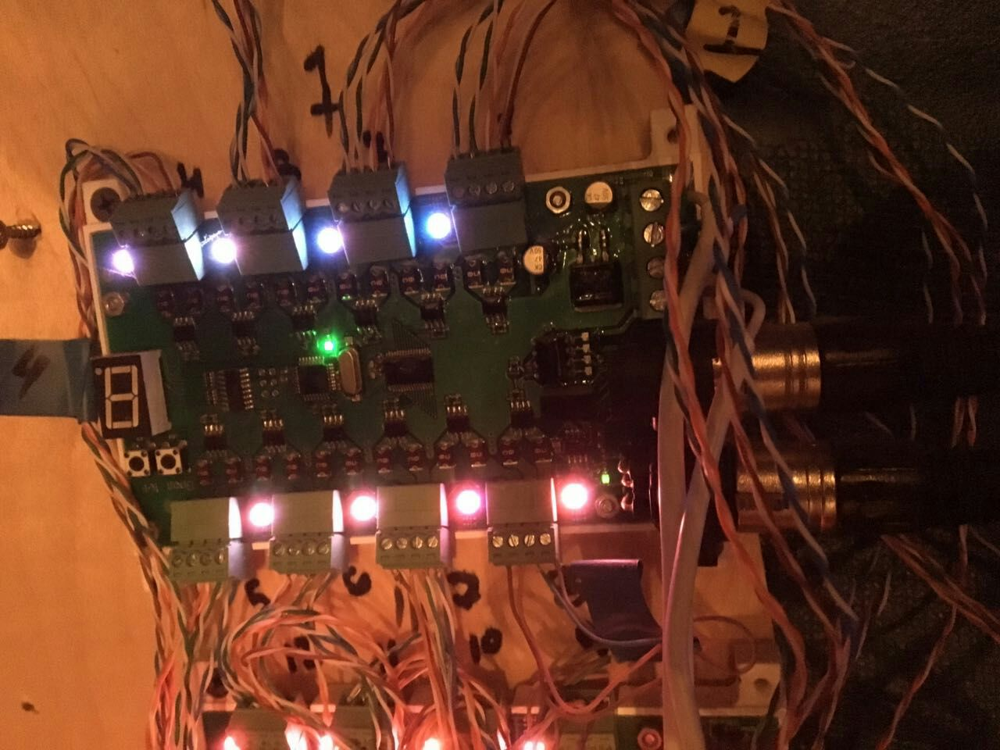

# Led matrix on DMX 512

This project aim is developing software and assembling hardware based on [ft232rl](docs/datasheets/DS_FT232R.pdf) and [max485](docs/datasheets/max485/pdf) integrated circuits.

The MAX481, MAX483, MAX485, MAX487–MAX491, and MAX1487 are low-power transceivers for [RS-485](https://en.wikipedia.org/wiki/RS-485) and [RS-422](https://en.wikipedia.org/wiki/RS-422) communication

## RS-485

RS-485 standard physical layer for the asynchronous interface.

RS-485 supports inexpensive local networks and multidrop communications links, using the same differential balanced line over twisted pair as RS-422. It is generally accepted that RS-485 can used with data rates up to 10 Mbit/s and distances up to 1,200 m (4,000 ft), but not at the same time. A rule of thumb is that the speed in bit/s multiplied by the length in meters should not exceed 108. Thus a 50 meter cable should not signal faster than 2 Mbit/s. Under some conditions it can be used up to data transmission speeds of 64 Mbit/s.

[en.wikipedia.org](https://en.wikipedia.org/wiki/RS-485)

## DMX 512

Communication Protocol DMX512 was developed by a Committee of the USITT in 1986, as a means to control intelligent lighting fixtures from different consoles through a single interface, allowing you to combine different control devices (remotes, etc.) with various terminal devices (dimmers, spotlights, strobe lights, smoke machines, etc.) from different manufacturers. It is based on industry-standard interface EIA/TIA-485 (also known as RS-485) used for computer control with industrial controllers, robots and automated machines. For data transfer using a cable with only two wires in the General screen with five-pin XLR connector. Although the interface specification provided by the use of five-pin connector, this is redundant and a big part of compatible equipment uses a three-pin connector.

[en.wikipedia.org](https://ru.wikipedia.org/wiki/DMX-512)

## Task

We have a some custom led matrix with 10x10 = 100 cells and 3 diodes in each cells (red, green, blue)

This matrix is controlled by 13 devices, which accept commands over dmx512 protocol to control the intensity of led-diodes.

Each device support 24 channels and can control 24 / 3 = 8 cells in matrix (3 colors on each cell). With 13 devices we can control 13 * 8 = 104 cells. It is enough for 10x10 matrix.

Example of one device

## Sunlite

Currently this matrix controlls by [Sunlite Suite](https://www.nicolaudie.com/ru/suite2.htm) for light visualizations.
Sunlite gives opportunities to create different visual effect by using editor.

## Proposal

But sunlite not allows users user custom controls by another software.

### First way

Create dmx controller by using ft232rl IC and MAX856

### Second way

Try to use driver of sunlite suite 2 for sending signals across sunlite controller.